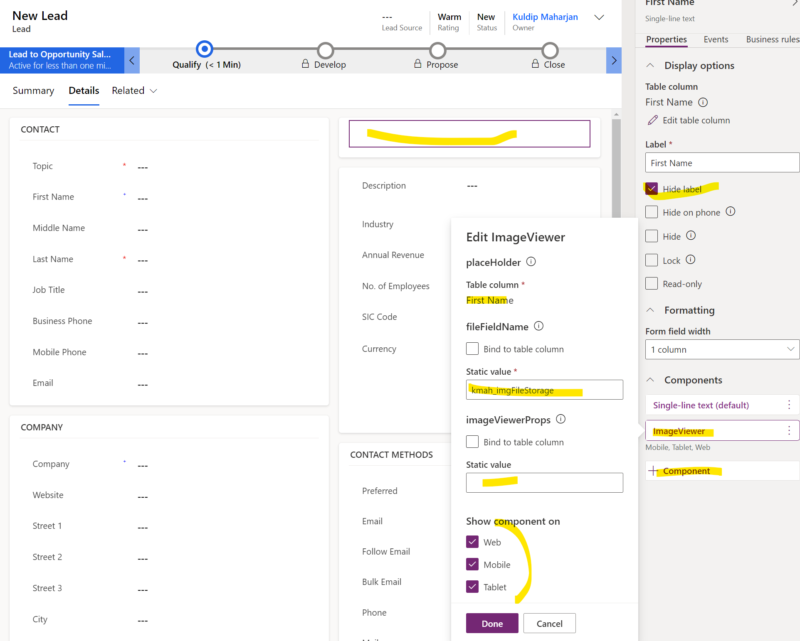

# ImageViewerPCF

## About
***This solution extends MS Dynamics Platform allowing users to upload/view Image(s) elegantly.***

**ImageViewerPCF** is a custom control that allows for the instant upload of images for any entity records once configured. With the introduction of the [File Data Type in Dataverse](https://learn.microsoft.com/en-us/power-apps/developer/data-platform/file-column-data?tabs=webapi), the Dynamics platform has expanded the potential solutions that can be achieved. This control relies on the DataType field and enhances the functionality of Dynamics CRM as the OOB version has no multi image viewing capability.

When image files are uploaded via File Explorer or through a drag-and-drop method, the image file binaries are converted into base64 format and then combined into a single base64 blob. This blob is uploaded into the configured file type field using Web API methods (limitations are covered later in this documentation). When viewing the control, it retrieves the file's base64 content, parses it accordingly, and renders the images.

## Features
- Display multiple images on any CRM Records' forms
- Upload image(s) via default file selector dialog or simply drag and drop image or group of images
- Navigate the images using arrow keys from keyboard, or on screen arrow keys, or by directly clicking on thumbnails
- Download specific image directly from the control
- Delete specific image directly from the control
- All image data are bundled and stored on the configured File column

## Demo
<video controls src="imageviewerNormal.mp4" title="Title"></video>

## Parameters
- **placeHolder**           - This can be any text field whose sole purpose is to host this pcf control
- **fileFieldName**         - This is the File Type field which will be used for storing the file base64 blobs
- **imageViewerProps**      - Not currently utilized. This will eventually be utilized to pass an environment variable name which will hold JSON name value pair for customizing extra parameters. (There is a but with 100 char limitation for PCF control props even if its set to different type. Hence an environment variable will be used)

## Setup
Import PCF control using one of two ways
1. Clone this project, [build](https://learn.microsoft.com/en-us/power-apps/developer/component-framework/create-custom-controls-using-pcf) and deploy it locally using instructions from [MS Docs](https://learn.microsoft.com/en-us/power-apps/developer/component-framework/import-custom-controls). 
2. Import the provided solution in this project directly in your Dynamics org
3. Create a File Type field under the Entity that you want to utilize this ImageViewerPCF's functionality
4. Create another placeholder field of type "single line of text". Its sole purpose is to host the pcf control in the Entity form
5. For field created in step #4, set it up in the form section as desired (or in a new tab)

6. For now the only required parameter is **placeholder** and **fileFieldName**. **placeholder** is tied to the text field hosting the pcf control. Make sure to hide the label for best results. **fileFieldName** is the File Type Field's logical name that you need to populate
7. Save and Publish the form changes
8. Enjoy this new feature upon navigating to the respective entity record's form

## Current Limitations
- Current iteration has the max upload size of 12MB due to latest CRM webapi requiring chunking when retrieving bigger files (> 16 MB). This issue will be eliviated in next iteration upon which the max upload size will be 1GB
- This control is supposed to be used for use cases where each records will only have limited images (totaling < 100 MB as recommendation for maximal performance) as each update on the image requires the code to patch the whole file binary
- As we rely on File type field which forces us to update the whole file blob, this technique is not performant as the total image size gets bigger specially if there is a need for constant update (don't get me wrong, it will work fine in practical sense but its not an optimal solution). Future version of this app could potentially allow connecting directly to cloud storage (Azure or AWS) but that would require extra mechanism to generate SAS tokens etc
